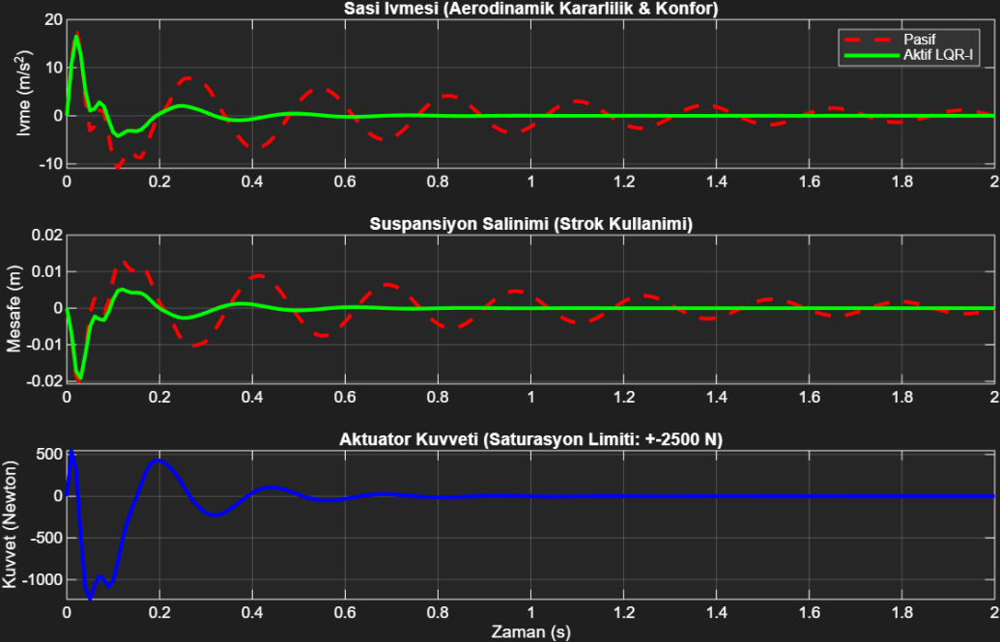
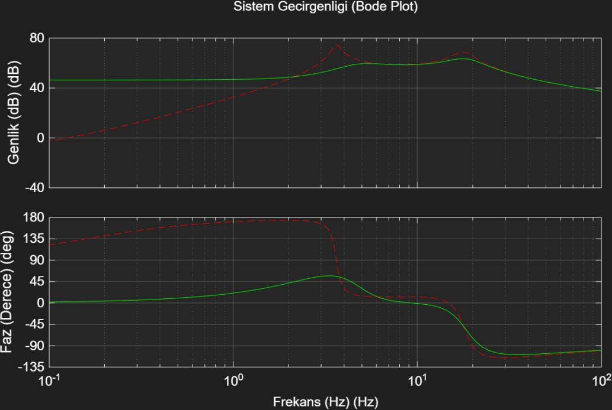
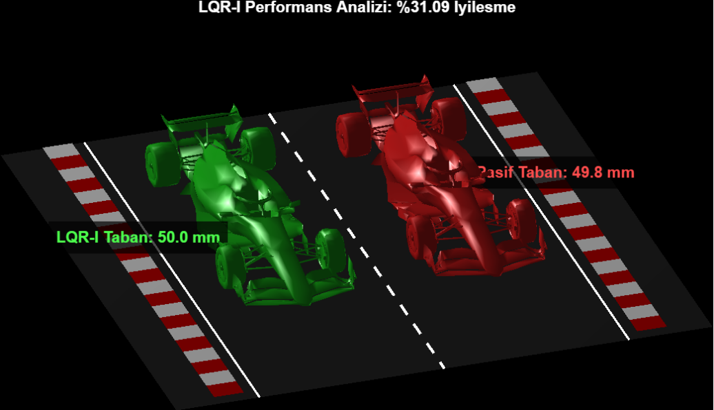

# Design and 3D Simulation of an LQR-I Based Active Suspension System for Formula 1 Cars

**Author:** Arda Can Öztürk  
*Electrical and Electronics Engineering, Dumlupınar University*

## Project Overview
In this project, an integral-action linear quadratic regulator (LQR-I) based active suspension system was designed and simulated in 3D in the MATLAB environment to optimize the aerodynamic stability and ride height of Formula 1 racing cars. 

The developed controller successfully maintains the nominal ride height of 50 mm against disturbing road profiles. An improvement of over **30%** was recorded in the RMS value of chassis acceleration in tests conducted under a stochastic road profile.

## Key Technical Features
*   **State-Space Modeling:** 2-DOF quarter-car model.
*   **Control Algorithm:** LQR with Integral Action (LQR-I).
*   **System Constraints:** Actuator Saturation limits ($\pm 2500$ N) and Anti-Windup integration.
*   **Validation:** Time-domain step response, frequency-domain Bode analysis, and real-time 3D OpenGL visualization.

## Simulation & Analysis Results

### 1. Time-Domain Response (2cm Step Input)
The LQR-I active suspension system dampens the chassis acceleration much faster compared to the passive system and enables the vehicle to quickly recover its floor height.

### 2. Frequency-Domain Analysis (Bode Plot)
The Bode plot shows that the active system significantly suppresses the amplitude value, especially at resonance frequencies, improving overall transmissibility.

### 3. 3D Real-Time Simulation
The analysis data were successfully visually validated by transferring them to a custom 3D MATLAB simulator running in real-time.

## How to Run the Simulation
1. Navigate to the `simulation` folder.
2. Ensure both `TEZ.m` and `f1_model.STL` are in the same directory.
3. Run `TEZ.m` in MATLAB.

*Note: For the full academic paper (IEEE format), please refer to the documents section.*
